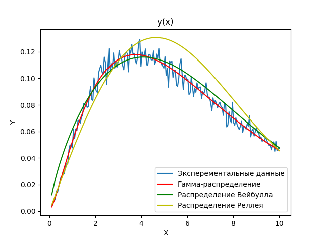
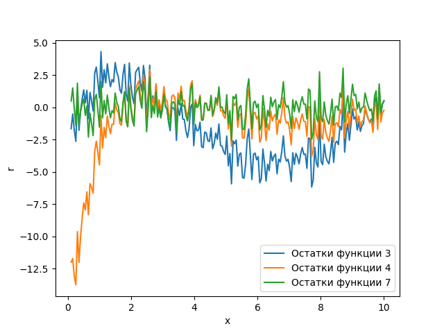
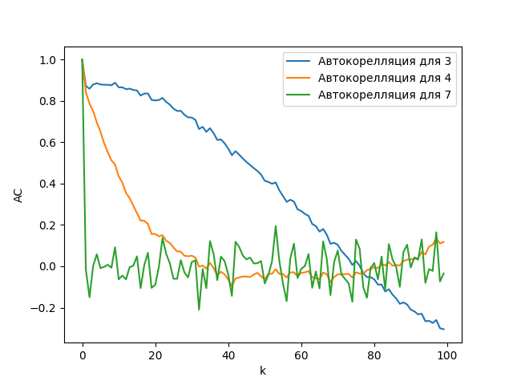

# НЕЛИНЕЙНЫЙ МЕТОД НАИМЕНЬШИХ КВАДРАТОВ

### Введение
В экспериментальной практике часто измеряют некоторую характеристику, которую можно выразить зависимостью y(x). При этом получают набор точек (xk, yk), где k = 1,2…N, N – количество точек в наборе данных.
Основной целью анализа данных y(x) является подбор некоторой функции или модели f(x, θ), где θ = (θ1, θ2, …, θp) – вектор параметров модели, значения которой наилучшим образом совпадают со значениями измеренной величины yk. Функцию f(x, θ) называют (не)линейной регрессионной моделью
(рис. 1).

В большинстве случаев подбор включает следующие шаги: 1) выбор вида функции f(x, θ); 2) инициализация вектора параметров θ начальными приближениями; 3) изменение значений параметров θ до тех пор, пока не будет достигнуто наилучшее совпадение между f(x, θ) и y(x). 

### Реализация
В [main.py](main.py) релизован метод наименьших квадратов для следующих законов распределения:
* Распределение Релея 
* Распределение Вейбулла
* Гамма распределение

Также был проанализирован качество анализа данных с помощью нормированного кри-
терия Chi^2, графика взвешенных остатков и их автокорреляционной функ-
ции.

Итог:

