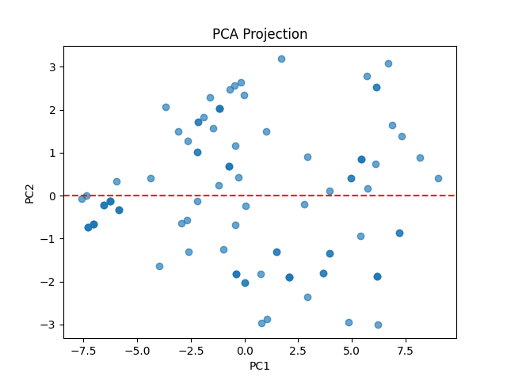

# МЕТОД ГЛАВНЫХ КОМПОНЕНТ
## Введение
Во многих экспериментах по обработке многомерных данных прихо-
дится сталкиваться с задачами связанными с наглядным представлением
данных (визуализация данных), снижением размерности данных без суще-
ственной потери информативности данных или (сжатием данных), стрем-
лением к лаконизму исследуемых данных (упрощение данных). Для реше-
ния подобных задач используются методы, в которых снижение размерно-
сти пространства происходит одновременно с его преобразованием. Это –
метод главных компонент, факторный анализ, канонический анализ. Харак-
терной особенностью данных методов является то, что происходит выбор и
оценка значимости не отдельных переменных, а информативных по сово-
купности групп переменных. В данной работе рассматривается метод глав-
ных компонент.

## Порядок реализации
1) Загрузить данные согласно варианту 4.
2) Нормировать (стандартизировать) исходные экспериментальные данные. Построить корреляционную матрицу.
3) Удостоверится, что корреляционная матрица значимо отличается
от единичной матрицы.
4) Рассчитать проекции объектов на главные компоненты.
5) Определить относительную долю разброса, приходящуюся на
главные компоненты. Построить матрицу ковариации для проек-
ций объектов на главные компоненты.
6) На основе первых M = 2 главных компонент построить диаграмму
рассеяния. Дать содержательную интерпретацию первых двух
главных компонент.
## Результат:

