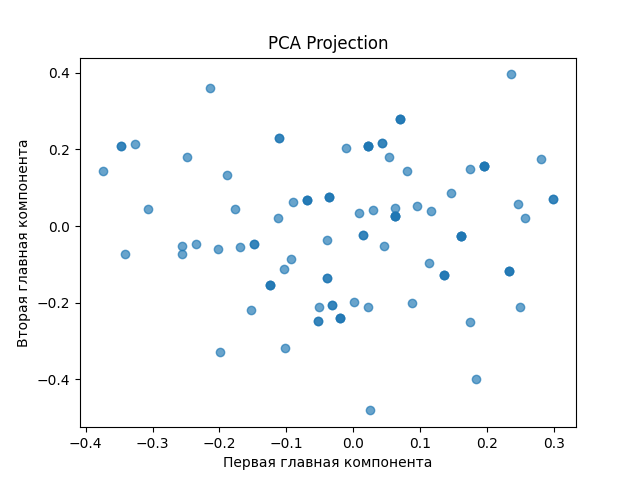

# МЕТОД ГЛАВНЫХ КОМПОНЕНТ
## Введение
Во многих экспериментах по обработке многомерных данных приходится сталкиваться с задачами связанными с наглядным представлением
данных (визуализация данных), снижением размерности данных без существенной потери информативности данных или (сжатием данных), стремлением к лаконизму исследуемых данных (упрощение данных).
Для решения подобных задач используются методы, в которых снижение размерности пространства происходит одновременно с его преобразованием. Это –
метод главных компонент, факторный анализ, канонический анализ. Характерной особенностью данных методов является то, что происходит выбор и
оценка значимости не отдельных переменных, а информативных по совокупности групп переменных. В данной работе рассматривается метод главных компонент.

## Порядок реализации
1) Загрузить данные из файла.
2) Нормировать (стандартизировать) исходные экспериментальные данные. Построить корреляционную матрицу.
3) Удостоверится, что корреляционная матрица значимо отличается
от единичной матрицы.
4) Рассчитать проекции объектов на главные компоненты.
5) Определить относительную долю разброса, приходящуюся на
главные компоненты. Построить матрицу ковариации для проек-
ций объектов на главные компоненты.
6) На основе первых M = 2 главных компонент построить диаграмму
рассеяния. Дать содержательную интерпретацию первых двух
главных компонент.
## Результат:
### График

### Вектор γ
Вектор γ = [0.8794, 0.9716, 0.9837, 0.9893, 0.9911, 0.993, 0.9968, 1.]      

