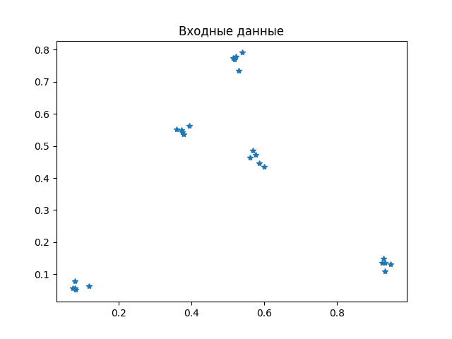
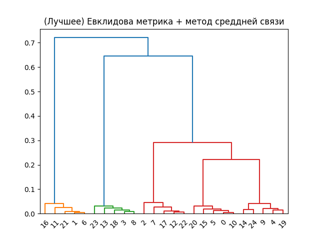
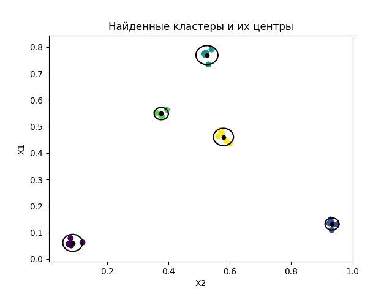

# Иерархические методы кластерного анализа.

## Суть метода:
Иерархический кластерный анализ является одним из способов разбиения данных на группы. Этот метод
рассматривает данные как иерархическую структуру, где каждый элемент начинает отдельной группой. Затем группы
объединяются, пока конечно не получится одна большая группа. В процессе объединения групп учитывается степень их
схожести, что позволяет находить скрытые закономерности в данных.

## Что получится в итоге: 
В результате работы иерархического кластерного анализа получается дендрограмма,
на которой видна структура данных. Каждый уровень дерева представляет собой группу объектов, а расстояние между
уровнями отражает степень схожести объектов в них. Информация об устройстве дерева позволяет определить число
групп, на которые можно разбить данные.

## Как проверить правильность итоговых данных: 
Для проверки правильности результатов необходимо применить оценку
качества кластеризации. Одним из способов является метод "Silhouette index", который оценивает расстояние между
объектами внутри кластера и между кластерами. Чем ближе значение индекса к 1, тем лучше кластеризация. Кроме того,
можно визуализировать группы на графике, чтобы оценить их взаимное расположение и схожесть.

# Результат
### Входные данные:

### Дендрограмма:

  Эвклидова    
* [0.93783264 0.91682242 0.89547293]
* [0.94346419 0.92154916 0.90152505]
* [0.94065798 0.92041684 0.90007696]

### Найденные кластеры:
