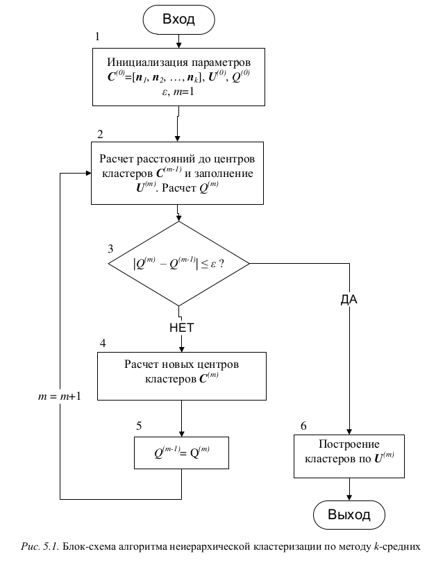
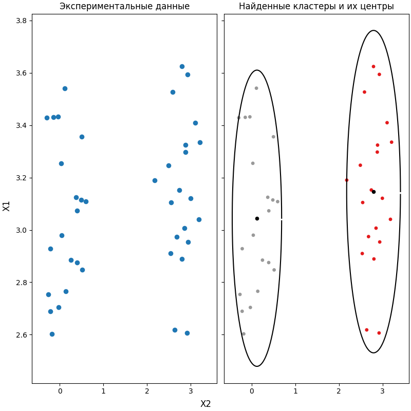

# НЕИЕРАРХИЧЕСКИЕ МЕТОДЫ КЛАСТЕРНОГО АНАЛИЗА

### Введение
При большом количестве объектов (N > 200) иерархические методы кла-
стерного анализа непригодны, ввиду больших вычислительных затрат и
сложности интерпретации дерева кластеров. В таких случаях могут исполь-
зоваться неиерархические методы кластерного анализа, одним из которых
является метод k-средних. Суть этого метода заключается в следующем.
Предположим, уже имеются гипотезы относительно числа кластеров – т.е.
заранее определено количество кластеров k, на которые необходимо раз-
бить имеющиеся объекты. Среди множества объектов выбираются k объек-
тов в качестве начальных центров кластеров. Для каждого объекта рассчи-
тываются расстояния до центров кластеров, и данный объект относится к
тому кластеру, расстояние до которого оказалось минимальным. После
чего, для этого кластера (в котором изменилось количество объектов) рас-
считывается новое положение центра кластера (как среднее по каждому
признаку Xi) по всем включенным в кластер объектам. В общем случае, в
результате применения метода k-средних исходное множество объектов
разделяется ровно на k различных кластеров, расположенных на возможно
больших расстояниях друг от друга.

### Алгоритм
Шаг 1. Инициализация начальных параметров метода.

Шаг 2. Рассчитать расстояния от объектов n1, n2, …, nN до центров кла-
стеров С^(m-1), определенных на предыдущей итерации. Заполнить матрицу
U(m), исходя из расположения центров С(m-1) вычисленных на предыдущей
итерации (блок 2). Рассчитать значение функционала качества кластериза-
ции Q(m) (с учетом С^(m-1)).

Шаг 3. Проверить условие остановки алгоритма | Q(m) – Q(m-1) | <= eps (блок
3). При этом оценивается, привело ли новое объединение объектов в кла-
стеры к существенному улучшению качества кластеризации. Если условие
выполняется, то завершить процесс кластеризации (блок 6). Иначе перейти
к шагу 4.

Шаг 4. Рассчитать новое положение центров кластеров С(m) как среднее
арифметическое по координатам объектов, входящих в соответствующие
кластеры (блок 4).

Шаг 5. Установить Q(m-1) = Q(m) и перейти к шагу 2 (новой итерации) с m
= m + 1 (блок 5).

## Результат

