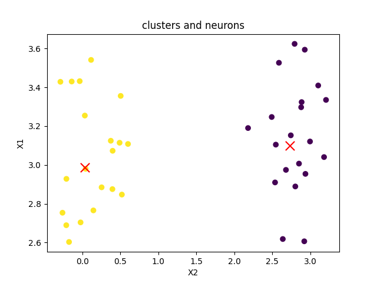

# Нейронные сети. Слой Кохонена

Цель работы: изучение алгоритма нейронной сети слой Кохонена для решения задачи кластерного анализа.

## Краткие сведения

Нейронные сети представляют собой широкий круг алгоритмов машинного обучения и используются для решения задач классификации, кластеризации, сглаживания функций, прогнозирования, оптимизации, управления и адресации памяти.

Основой нейронной сети является искусственный нейрон – математическая модель нейрона мозга живых организмов. Искусственный нейрон состоит из синапсов (умножителей), ядра и аксона. Нейрон воспринимает входные сигналы через синапсы. Каждый синапс имеет вес, который определяет, насколько соответствующий вход нейрона влияет на его состояние.

Для формирования искусственной нейронной сети отдельные нейроны объединяются в сети с определенной топологией. Функции активации нейронов выбираются и фиксируются на этапе проектирования сети, веса сети являются её параметрами и могут изменять свои значения. Работа нейронной заключается в преобразовании независимых переменных объекта в выходную зависимую переменную.

## Слой Кохонена (слой «соревнующихся» нейронов)

Нейронные сети Кохонена представляют собой класс нейронных сетей, основным элементом которых является слой Кохонена. Алгоритм функционирования самообучающегося слоя Кохонена является одним из вариантов кластеризации многомерных данных.

По аналогии с алгоритмом кластеризации k-средних, нейроны слоя Кохонена представляют собой узлы или центры кластеров. Нейронная сеть анализирует выходные значения нейронов слоя и в качестве результата выдает номер наиболее близко расположенного нейрона сети (нейрона-«победителя») к классифицируемому объекту. Номер активного нейрона-«победителя» определяет ту группу (кластер), к которой наиболее близок входной вектор-объект. 

## Задача

Задача сводится к поиску минимума некоторой функции ошибок, например – суммы квадратов расстояний до центров кластеров или нейронов слоя. 

# Результат

