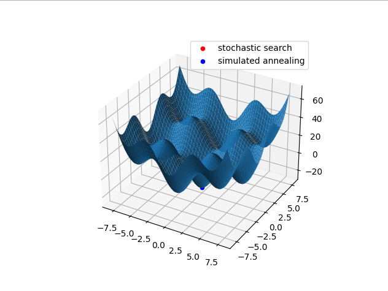
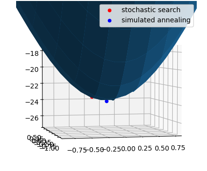

# Метод стохастического поиска и метод имитации отжига




## Результаты для стохастического поиска
Для 
```N=1000```

* Минимальное значение F (stochastic search): -23.55539929219614

* X_min (stochastic search): [-0.21098716  0.15518153]
## Результаты для имитации отжига
Для 
```Начальной температуры: T=50.0,```
```Конечной температуы: T0=0.001,```
```С шагомv=0.99.```

* Минимальное значение F (simulated annealing): -23.998488666811845

* X_min (simulated annealing): [-0.01245153 -0.00880196]